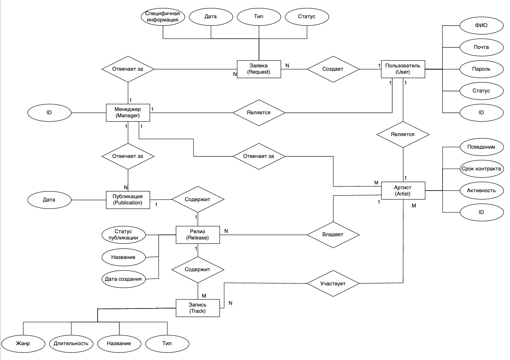
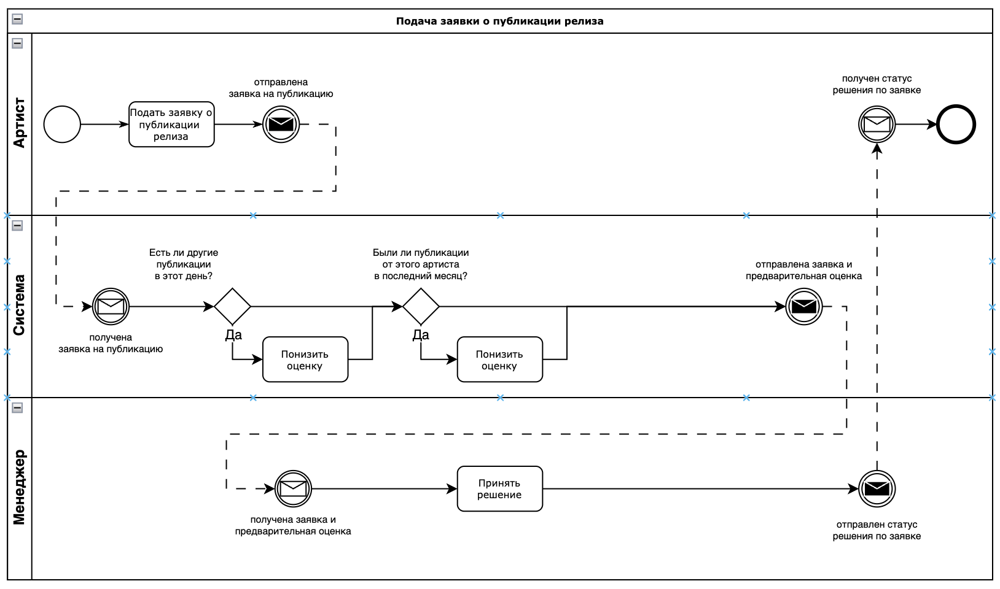

# Основы разработки web-приложений

## Название проекта
Cook Droogers'

## Краткое описание идеи проекта
Сайт для музыкального лейбла, предназначенный для автоматизации взаимодействия менеджеров и артистов.

Предоставить артистам возможность узнать информацию о лейбле и подать заявку на вступление, его участникам - возможность опубликовать свое творчество, а менеджерам - возможность просмотреть заявки, опубликовать релиз, заняться управлением артистами, получить данные по статистике релизов.

Посредством сайта артисты смогут узнать о решениях менеждмента.

## Краткое описание предметной области

Предметная область - музыкальное объединение.

Автоматизация работы бизнес-процессов лейбла на стыке артистов и менеджмента. Ключевым элементом является система заявок и обработка статистики, полученной от стриминговых сервисов.

## Актуальность

Каждое музыкальное объединение (музыкальный лейбл) должно сохранять информацию о творчестве артистов, о контрактах и т.д и т.п. Артисты устали решать все вопросы по почте, а менеджеры - вручную загружать информацию в систему. Возможность получить отчет-анализ, позволяющий спрогнозировать статистику, уже давно применяется в различных отраслях, однако до музыкального бизнеса это пока не добралось. Автоматизация такого бизнеса необходима.
В связи с уходом из России SonyMusic, у артистов больше не осталось возможности посредством сайта/приложения согласовывать публикации и видеть статистику по своим релизам.

## Описание ролей
**Гость** - неавторизованный пользователь, который может лишь посмотреть (урезанную) информацию о лейбле, авторизоваться, зарегистрироваться

**Пользователь** - авторизованный, может посмотреть расширенную информацию о лейбле и подать заявку о вступлении.

**Артист** - принятый в лейбл пользователь, может загрузить свой релиз, подать заявку на его публикацию, получить статистику своих релизов, имеет личного менеджера.

**Менеджер** - сотрудник лейбла, курирует несколько артистов, отвечает на заявки (заявку на вступление получает случайный менеджер), может получить данные о статистике релизов его артистов.

**Администратор** - сотрудник лейбла, назначает менеджеров.

## Use-Case диаграмма

## ER диаграмма

## Сложные сценарии

#### Подача (и обработка) заявки на публикацию релиза:
1. артист заносит данные о желаемой публикации, заявка сохраняется в системе, ей задается статус "в работе" и она отобаражается в списке заявок артиста;
1. система совершает предварительную оценку заявки:
* проверяется есть ли в этот день публикации от других артистов (запрос в базу);
* проверяется были ли публикации релизов этого артиста в последнее время (запрос в базу);
* запуск алгоритма анализа статистики твсех треков лейбла чтобы проверить актуальность жанра (вероятнее всего, это будет линейная регрессия + экстраполяция);
3. заявка отображается в списке заявок менеджера, к которому прикреплен данный артист, показывается предварительная оценка системы;
4. менеджер отклоняет заявку/принимает заявку/отменяет и назначает публикацию самостоятельно

#### Формирование отчета для _менеджера_

Происходит анализ статистики релизов, по итогам которого определяется:
* предполагаемые прослушивания в следующем полугодии по артистам (точный срок пока не определен) (только для прикрепленных к менеджеру артистов) (вероятнее всего линейная регрессия + экстраполяция)
* актуальный жанр (анализ всех треков лейбла) (сравнение предполагаемых прослушиваний)
* изменения в прослушиваниях\лайках курируемых артистов
* данные предыдущего отчета (чтобы оценить динамику)
* графики, отображающие эти показатели;
* самый прослушиваемый трек, релиз, артист (среди курируемых).

Статистика загружается со "стримингового сервиса": в приложении предусмотрен route (/statistics), при отправке на который POST запроса с информацией со стороны отдельного сервиса в JSON формате, она средставми основного приложения автоматически заносится в БД, откуда она уже будет выбираться для анализа.
Этот вспомогательный сервис также будет реализован в рамках этой работы: он "должен" собирать статистику со стриминговых сервисов, однако на деле это будет заглушка, которая при запуске будет присылать заранее подготовленные и/или случайные данные.

## Пользовательские сценарии

**Гость** может:
- авторизоваться (ввести логин и пароль учетной записи);
- зарегистрироваться (создать учетную запись).

После авторизации гость становится *пользователем*.

**Пользователь** может:
- подать заявку на вступление в лейбл;

После согласования заявки на вступление в лейбл пользователь становится *артистом*.

**Артист** может:
- загрузить релиз (альбом/сингл/EP/микстейп, который будет состоять из информации о релизе и содержащихся треках)
- подать заявку на публикацию релиза (выбрать свой неопубликованный релиз и желаемую дату публикации);
- получить актуальную статистику своих релизов

**Менеджер** может:
- получить данные о статистике релизов своих артистов; 
- принять заявку вступления в лейбл (просмотреть заявки и принять/отклонить ее);
- принять заявку о публикации релиза (выбрать заявку и принять/отменить ее);
- посмотреть статистику релизов.

**Администратор** может:
- посмотреть список менеджеров; 
- посмотреть список пользователей;
- назначить менеджера.

## BPMN-диаграмма

## Описание типа приложения и выбранного технологического стека

Язык: Go (1.22)

БД: PostgreSQL

## Верхнеуровневое разбиение на компоненты

## Схема базы данных

## Функциональные требования

Функциональные требования к страницам:

1. Авторизации
- ввод логина и пароля
- отображение лого

2. Личного кабинета (далее ЛК)
В зависимости от типа учётной записи (обычный пользователь, артист, менеджер, админ) отображаемые элементы отличаются.

2.1. Общая информация (для любого типа пользователя):
- логин
- имя
- тип учётной записи
- подача заявки на становление артистом

2.2. Артист:
- ник менеджера 
- свой ник
- срок контракта
- активность (живой/не живой, занимается ли музыкой до сих пор) 
- создание релизов (релиз == 1+ треков). Релизами управляет артист, их публикацией — менеджер.
- подача заявки на публикацию релиза

2.3. Менеджер:
- список записанных на него артистов (их имена и ники)
- входящие заявки на становление артистами (вопрос о сроке контракта)
- утверждение заявок на публикацию релизов (решение о публикации принимает менеджер)

2.4. Админ:
- просмотр пользователей
- назначение пользователя менеджером

3. Подача заявок:

3.1. Становление артистом:
- указание ника

3.2. Публикация:
- указание артистом созданного релиза
- дата публикации

4. Создание релиза:
- указание входящих в релиз треков
- название
- дата релиза 

5. Отображение релиза:
Аналогично п.4, только добавляется статус готовности

6. Создание/отображение трека внутри создания релиза:
- жанр
- название
- тип (интро/аутро/ремикс/как артист назовёт)
- длительность
- сам трек в виде файла